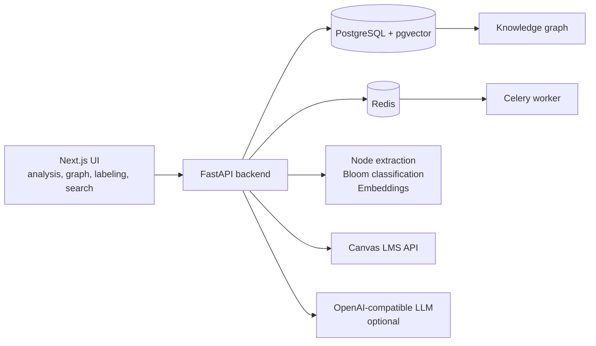
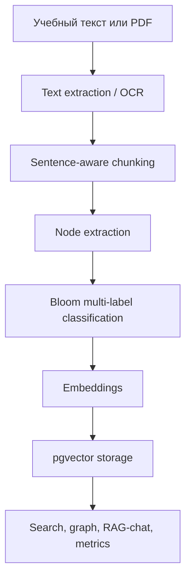

# Bloom RAG Studio

> RAG-инструмент для анализа учебных материалов: выделяет смысловые узлы, классифицирует их по таксономии Блума, строит интерактивный граф знаний и помогает проверять качество разметки.


## Зачем проект

Bloom RAG Studio помогает быстро понять, какие когнитивные уровни преобладают в учебном тексте, задании, модуле курса или наборе документов.

Проект полезен для:

- преподавателей, которые хотят увидеть когнитивный профиль материала;
- методистов, проверяющих баланс уровней Блума;
- исследовательских и школьных ИВР-проектов, где нужны метрики качества;
- разработчиков, которым нужен воспроизводимый RAG-прототип на FastAPI, pgvector и Next.js.

## Что умеет

- Принимать текст и документы, включая PDF.
- Извлекать смысловые узлы: понятия, темы, цели, действия и ключевые термины.
- Классифицировать узлы по 6 уровням таксономии Блума: Remember, Understand, Apply, Analyze, Evaluate, Create.
- Работать offline-first: keyword + morphology baseline не требует GPU и API-ключей.
- Подключать LLM-режим для более сильной классификации через OpenAI-compatible API.
- Хранить документы, чанки, узлы, эмбеддинги и связи в PostgreSQL + pgvector.
- Строить интерактивный граф знаний с фильтрами по уровням Блума.
- Давать поиск по документам и узлам знаний.
- Поддерживать ручную multi-label разметку и экспорт датасета.
- Интегрироваться с Canvas LMS для загрузки структуры курса.
- Показывать dashboard по датасетам, задачам и качеству прототипа.
- Предоставлять RAG-chat поверх базы знаний.

## Быстрый старт

### Требования

- Docker Desktop 24+ с Compose v2.
- 4 GB свободной RAM.
- Git.
- Опционально: `OPENAI_API_KEY` или совместимый LLM endpoint для LLM-режима.

### Запуск через Docker

```bash
git clone https://github.com/JapanDino/RAG-tool.git
cd RAG-tool
cp backend/.env.example backend/.env
docker compose up --build
```

После запуска:

- UI: <http://localhost:3000>
- API docs: <http://localhost:8000/docs>
- Health check: <http://localhost:8000/health>

Первый запуск может занять больше времени: локальная embedding-модель скачивается в cache.

### Локальный запуск

Подробный вариант для локальной разработки описан в [README_DOCKER_SETUP.md](README_DOCKER_SETUP.md).

Коротко:

```bash
pip install -r backend/requirements.txt
cd frontend && npm install
```

API:

```bash
scripts/run_api.sh
```

Frontend:

```bash
scripts/run_frontend.sh
```

Для Windows PowerShell в репозитории есть вспомогательные скрипты в `scripts/`.

## Демо за 2 минуты

1. Откройте <http://localhost:3000>.
2. Создайте датасет, например `Алгоритмы`.
3. Вставьте текст:

```text
Решите уравнение и покажите ход решения. Проанализируйте ошибки в вычислениях.
```

4. Нажмите **Анализировать**.
5. Посмотрите таблицу узлов и перейдите во вкладку **Граф знаний**.

Ожидаемый профиль: `apply` + `analyze`.

Больше готовых примеров: [docs/DEMO_EXAMPLES.md](docs/DEMO_EXAMPLES.md).

## Интерфейс

Основные вкладки приложения:

| Вкладка | Что делает |
|---|---|
| Анализ контента | Принимает текст/файл, извлекает узлы, показывает Bloom-профиль |
| Граф знаний | Визуализирует узлы и связи, дает фильтры по уровням |
| Разметка | Позволяет экспертно исправлять multi-label уровни |
| Поиск | Ищет по чанкам и узлам знаний |
| Dashboard | Сводит состояние датасетов, документов, задач и метрик |
| Canvas | Загружает материалы курса из Canvas LMS |
| RAG-chat | Отвечает с опорой на найденные фрагменты базы знаний |

## Архитектура



Ключевой pipeline:



## Стек

| Слой | Технологии |
|---|---|
| API | FastAPI, Uvicorn, Pydantic v2 |
| NLP | pymorphy3, natasha, sentence-transformers |
| Vector search | PostgreSQL 16, pgvector |
| Queue/cache | Redis, Celery |
| Frontend | Next.js 14, React, Cytoscape.js |
| OCR/PDF | Tesseract, pdf2image, pdfminer |
| Infra | Docker Compose |

## Качество классификации

В репозитории есть размеченный датасет `data/bloom_dataset.jsonl` на 109 примеров.

Текущий baseline из `data/eval_report_full.json`:

| Метрика | Значение |
|---|---:|
| Samples | 109 |
| Hamming loss | 0.162 |
| F1-micro | 0.629 |
| F1-macro | 0.640 |
| Cohen's kappa macro | 0.543 |

Запуск оценки:

```bash
python scripts/evaluate_multilabel.py --data data/bloom_dataset.jsonl --out data/eval_report.json
```

Интерпретация: baseline уже дает рабочую offline-классификацию без внешней модели, а LLM-режим можно использовать как более сильный, но более дорогой вариант.

## Настройки

Основные переменные лежат в [backend/.env.example](backend/.env.example).

| Переменная | Значения | Назначение |
|---|---|---|
| `DATABASE_URL` | PostgreSQL URL | Подключение к базе |
| `REDIS_URL` | Redis URL | Очереди и фоновые задачи |
| `EMBEDDING_PROVIDER` | `local`, `hash`, `openai` | Источник эмбеддингов |
| `EMBEDDING_MODEL_LOCAL` | HuggingFace model ID | Локальная embedding-модель |
| `BLOOM_CLASSIFIER` | `keyword`, `llm` | Режим классификации |
| `NODE_EXTRACTOR` | `local_ner`, `heuristic` | Извлечение узлов |
| `OPENAI_API_KEY` | API key | Нужен только для OpenAI/LLM режимов |
| `CANVAS_URL` | URL Canvas | Нужен для Canvas LMS |
| `CANVAS_TOKEN` | token | Нужен для Canvas LMS |

## Структура проекта

```text
RAG-tool/
├── backend/
│   ├── app/
│   │   ├── routers/       # FastAPI endpoints
│   │   ├── services/      # NLP, embeddings, Canvas, LLM, text extraction
│   │   ├── models/        # SQLAlchemy models
│   │   ├── schemas/       # Pydantic contracts
│   │   └── utils/         # Bloom, vector, quality helpers
│   ├── migrations/        # SQL migrations
│   └── requirements.txt
├── frontend/
│   ├── components/        # Graph, job status, UI widgets
│   ├── pages/             # Next.js pages
│   ├── styles/            # CSS modules and globals
│   └── lib/               # Bloom constants
├── data/
│   ├── bloom_dataset.jsonl
│   ├── bloom_verbs_ru.json
│   └── eval_report*.json
├── docs/
│   ├── DEMO_EXAMPLES.md
│   ├── DEFENSE_MATERIALS.md
│   ├── DEVELOPMENT_PLAN_TZ_BLOOM.md
│   └── canvas_integration.md
├── scripts/
├── tests/
└── docker-compose.yml
```

## API

После запуска доступен Swagger UI:

- <http://localhost:8000/docs>
- <http://localhost:8000/openapi.json>

Ключевые группы endpoint'ов:

| Prefix | Назначение |
|---|---|
| `/analyze` | Анализ текста, извлечение и классификация узлов |
| `/datasets` | Датасеты, документы, индексация |
| `/nodes` | Узлы знаний и поиск по ним |
| `/graph` | Граф знаний, ребра, кластеры |
| `/labeling` | Очередь экспертной разметки |
| `/evaluate` | Метрики качества |
| `/canvas` | Canvas LMS интеграция |
| `/chat` | RAG-chat stream |

## Тесты

```bash
cd backend
pip install -r requirements.txt
python -m pytest ../tests -v
```

Если работаете через Docker, сначала поднимите инфраструктуру:

```bash
docker compose up -d db redis
```

## Документы

- [docs/DEMO_EXAMPLES.md](docs/DEMO_EXAMPLES.md) - готовые тексты для демонстрации.
- [docs/DEFENSE_MATERIALS.md](docs/DEFENSE_MATERIALS.md) - сценарий защиты и список артефактов.
- [docs/DEVELOPMENT_PLAN_TZ_BLOOM.md](docs/DEVELOPMENT_PLAN_TZ_BLOOM.md) - план разработки по ТЗ.
- [docs/canvas_integration.md](docs/canvas_integration.md) - интеграция с Canvas LMS.
- [REVIEW.md](REVIEW.md) - ревью проекта.
- [TODO_TECH.md](TODO_TECH.md) - технический backlog.

## Ограничения

- Keyword baseline иногда переоценивает уровни, если в тексте есть сильные глаголы-маркеры без явного учебного действия.
- Локальная embedding-модель требует времени на первую загрузку.
- OCR зависит от установленного Tesseract и качества исходного PDF.
- LLM-режим зависит от внешнего API и может быть медленнее offline baseline.

## License

MIT
