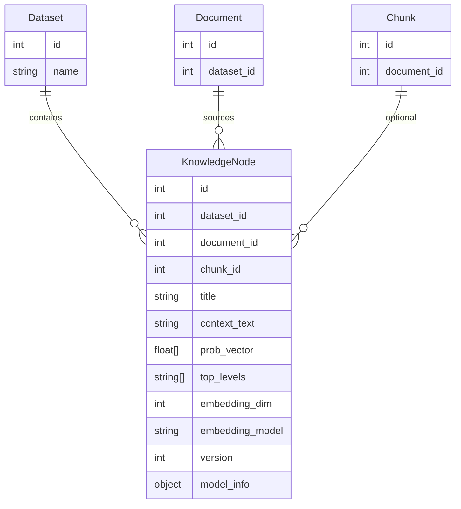

# План разработки по ТЗ: RAG‑разметка с привязкой к таксономии Блума

Источник требований: `ТЗ_на_RAG_разметку_с_привязкой_к_таксономии_Блума.docx`.

## Правила выполнения плана (для агента)
- **1 промпт = 1 шаг** из списка S0..S12.
- После шага: короткий отчёт, проверить конфликты/логику/UI, обновить статусы в этой таблице, затем коммит в отдельную ветку с именем шага.

## Таблица статусов шагов

| Шаг | Название | Статус |
| --- | --- | --- |
| S0 | Нормализация плана и трекинга | done |
| S1 | Контракт данных “узел” и “вероятности” | done |
| S2 | Миграции БД под `KnowledgeNode` и multi‑label | todo |
| S3 | CRUD/API для узлов | todo |
| S4 | ExtractNodes (MVP) | todo |
| S5 | Multi‑label классификация (MVP) | todo |
| S6 | Endpoint “Анализ контента” | todo |
| S7 | Embeddings для узлов | todo |
| S8 | Рёбра графа | todo |
| S9 | UI: вкладка “Анализ контента” | todo |
| S10 | UI: вкладка “Граф знаний” | todo |
| S11 | Метрики качества (Hamming, F1) | todo |
| S12 | Материалы для защиты | todo |

## 1) Цель конечного продукта

Приложение для учителей, которое:
- принимает образовательный текст (вставка/файл `.txt`);
- выделяет **узлы знаний** (смысловые единицы);
- присваивает каждому узлу **1+ уровней таксономии Блума** с вероятностями (multi‑label);
- сохраняет узлы в базу (RAG‑совместимую: текст + embedding + метаданные);
- показывает результаты как **интерактивный граф знаний** + табличный отчёт;
- позволяет фильтровать/искать/редактировать результаты.

Варианты поставки:
- **Desktop (.exe)** для удобства (Windows): один инсталлер/portable, локальный интерфейс.
- **Web (Docker)** как альтернативный способ развёртывания (для школ/серверов).

## 2) Архитектурная стратегия (рекомендуемая)

### 2.1 Desktop‑вариант (приоритет, .exe)
- UI: **Tauri** (или Electron) как оболочка “приложение”, внутри — web‑UI.
- Backend: текущий **FastAPI** (локально запускается внутри приложения/рядом).
- DB: для “одного учителя” разумно начать с **SQLite** (простая поставка), позже — Postgres/pgvector.
- Граф: визуализация на фронте (Cytoscape.js / Sigma.js / vis-network).

Почему так: учителю не нужно “поднимать сервер”, всё локально и удобно.

### 2.2 Web‑вариант (альтернатива)
- Docker Compose (уже есть): API + Postgres + Redis + Frontend.

## 3) План работ (детализировано)

### Шаг 0 — Нормализация плана и трекинга
- Убрать дубли/противоречия в плане.
- Добавить таблицу статусов S0..S12 (см. выше).
- **Готово**: план единый, таблица статусов заполнена.

### Шаг 1 — Контракт данных “узел” и “вероятности”
- Определить порядок уровней Блума.
- Формат `prob_vector`: `[p_remember, p_understand, p_apply, p_analyze, p_evaluate, p_create]`.
- Сущность `KnowledgeNode`: `dataset_id`, `title`, `context`, `prob_vector`, `top_levels`, `embedding`, `version`, `model_info`.
- **Готово**: схема данных (можно Mermaid ERD) зафиксирована в этом документе.

#### Контракт данных (зафиксирован)
Порядок уровней Блума для `prob_vector`:
`[remember, understand, apply, analyze, evaluate, create]`

`KnowledgeNode`:
- `dataset_id`: int
- `document_id`: int | null
- `chunk_id`: int | null
- `title`: string
- `context_text`: string
- `prob_vector`: float[6] (в порядке выше)
- `top_levels`: string[] (подмножество уровней Блума)
- `embedding_dim`: int
- `embedding_model`: string
- `version`: int
- `model_info`: object
- `created_at`: datetime

### Шаг 2 — Миграции БД под `KnowledgeNode`
- Добавить таблицы для узлов и их embedding’ов.
- Индексы по `dataset_id` и `embedding`.
- **Готово**: миграции применяются на чистой БД.

### Шаг 3 — CRUD/API для узлов
- `POST /nodes` (bulk), `GET /nodes`, `GET /nodes/{id}`, `PUT /nodes/{id}`, `DELETE /nodes/{id}`.
- **Готово**: эндпоинты работают, схемы в `backend/app/schemas`.

### Шаг 4 — ExtractNodes (MVP)
- Базовый извлекатель узлов из русского текста.
- Опционально: spaCy/Stanza как pluggable provider.
- **Готово**: `POST /analyze/extract` возвращает стабильный JSON.

### Шаг 5 — Multi‑label классификация по Блуму (MVP)
- Вернуть 6 вероятностей по уровням на каждый узел.
- Baseline: глоссарий глаголов/паттернов.
- LLM‑провайдер (опционально).
- **Готово**: `POST /analyze/classify` возвращает prob_vector.

### Шаг 6 — Endpoint “Анализ контента”
- `POST /analyze`: extract → classify → persist → embed.
- **Готово**: сценарий “вставил текст → получил узлы” закрыт.

### Шаг 7 — Embeddings для узлов
- Использовать текущий embedding‑сервис.
- **Готово**: поиск по узлам (`GET /nodes/search`).

### Шаг 8 — Рёбра графа
- Рёбра по близости embedding’ов и co‑occurrence.
- **Готово**: `GET /graph` возвращает nodes+edges.

### Шаг 9 — UI: вкладка “Анализ контента”
- Поле ввода текста, загрузка `.txt`.
- Таблица узлов, экспорт CSV/JSON.
- **Готово**: пользовательский сценарий работает.

### Шаг 10 — UI: вкладка “Граф знаний”
- Цвет по argmax, градиент при 2+ prob > порога.
- Hover‑карточка, фильтры, масштабирование.
- **Готово**: интерактивный граф соответствует ТЗ.

### Шаг 11 — Метрики качества
- Экспертная разметка (>=100 примеров).
- Hamming Loss, F1 micro/macro.
- **Готово**: воспроизводимый отчёт по качеству.

### Шаг 12 — Материалы для защиты
- Инструкция запуска, демо‑примеры, дамп БД.
- Скриншот/видео графа знаний.
- **Готово**: комплект артефактов сформирован.

## 4) Что уже сделано в текущем репозитории (по факту кода)

Сделано:
- FastAPI backend и сущности `Dataset`, `Document`, `Chunk`, `Embedding`, `Rubric`, `BloomAnnotation`, `Job`.
- Загрузка документов и чанкование (фиксированный размер).
- Индексация embedding’ов в pgvector и поиск.
- Rubrics CRUD+seed.
- Single‑level аннотация + валидация/fallback.

Не сделано по ТЗ:
- Узлы знаний как отдельная сущность (NER/semantic chunking).
- Multi‑label вероятности по 6 уровням на каждый узел.
- Формирование рёбер и UI графа.
- UI с 2 вкладками.
- Метрики multi‑label качества на экспертной разметке 100+ примеров.
- Материалы для защиты (дампы/скриншоты/видео).
