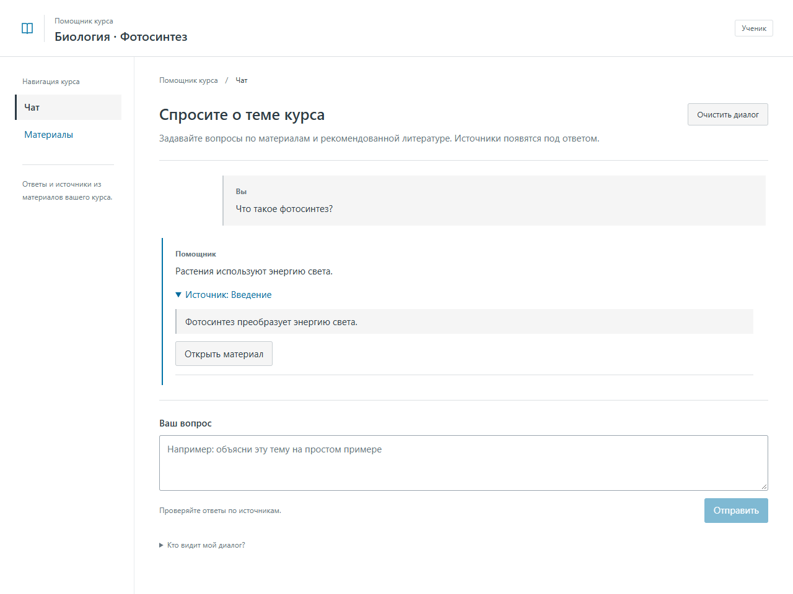
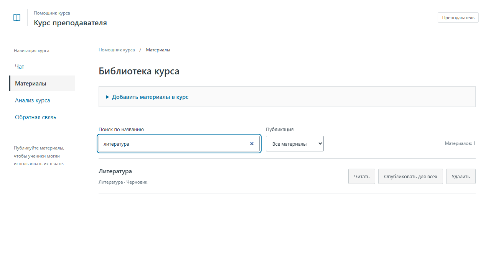
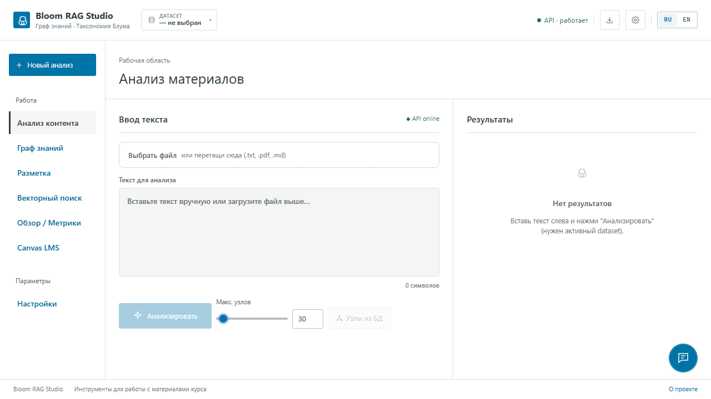
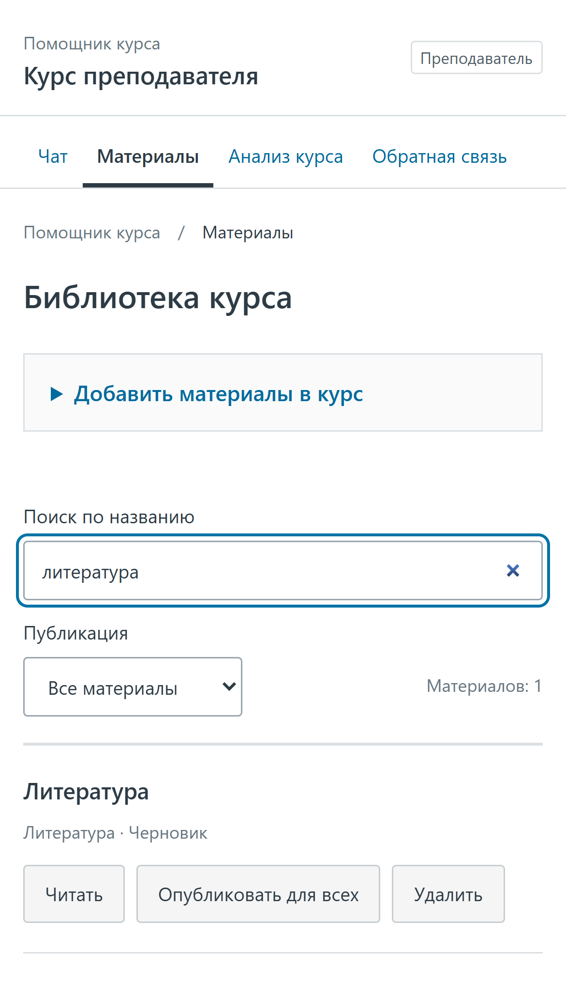
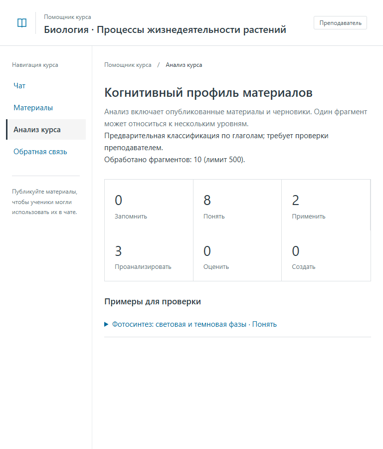

# Интерфейс помощника курса

Светлый интерфейс в духе Canvas: навигация курса слева, синее основное действие, нейтральные поверхности, тонкие границы и читаемые заголовки. На небольшом экране навигация переносится наверх. Шрифты системные, без внешней загрузки.

## Ученик

Чат предлагает примеры вопросов, показывает цитаты под ответом и позволяет открыть полный материал. Объяснение обработки диалога доступно рядом с формой. В библиотеке можно искать материалы по названию и оставить отдельный отзыв.



## Преподаватель

Библиотека содержит поиск и фильтр «Все материалы / Опубликованные / Черновики». Загрузка литературы и импорт Canvas находятся в раскрываемом блоке. Чтение, публикация, скрытие и удаление доступны у каждого материала. Анализ и обратная связь вынесены в отдельные разделы.



## Studio

Общие цвета и типографика применены также к студии, графу и состояниям задач. Навигация содержит рабочие разделы; декоративные счётчики и пункты без действий удалены. Поиск в шапке открывает раздел поиска, кнопка датасета переводит к выбору ID.



## Проверка

Дополнительный аудит выполнен в работающем локальном приложении с PostgreSQL, Redis, семантической моделью и Letovo: [сценарии и ограничения](PILOT_VERIFICATION.md). Пользовательские шаги описаны в [руководстве](USER_GUIDE.md).

Мобильная библиотека и анализ при ширине 768 px в автоматических проверках компоновки:





Скриншоты получены из production-сборки с **синтетическими данными и подменённым API**, без данных учеников. Проверены широкая и мобильная компоновка в Chrome, поиск/фильтры, роли, публикация, чат, источники, отзывы, окончание сессии и навигация студии. Диалоги поддерживают Tab, Shift+Tab, Escape и возврат фокуса к открывшей кнопке; есть ссылка пропуска навигации и поддержка reduced motion.

```powershell
cd frontend
npm run build
$env:PLAYWRIGHT_CHANNEL = 'chrome'
npm run test:e2e
```

Эти проверки интерфейса не заменяют приёмку реального LTI-запуска в Canvas; см. [отчёт пилота](PILOT_VERIFICATION.md).
