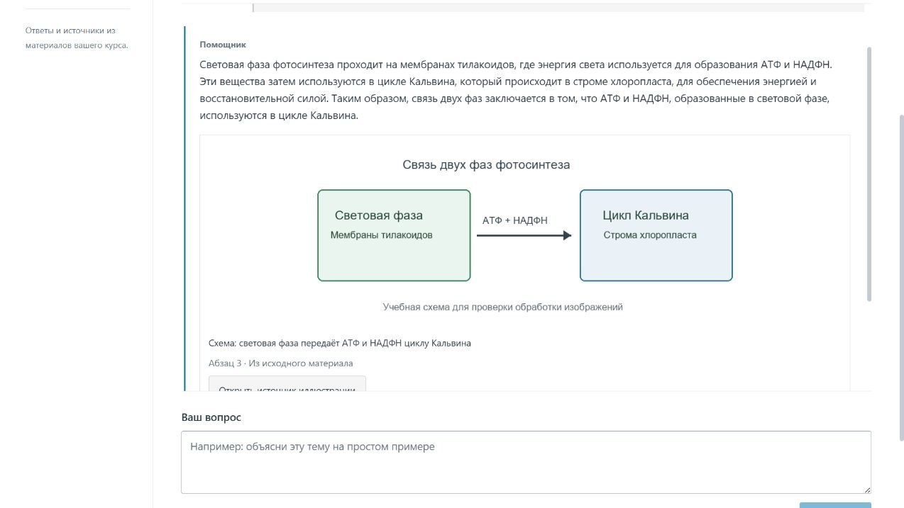
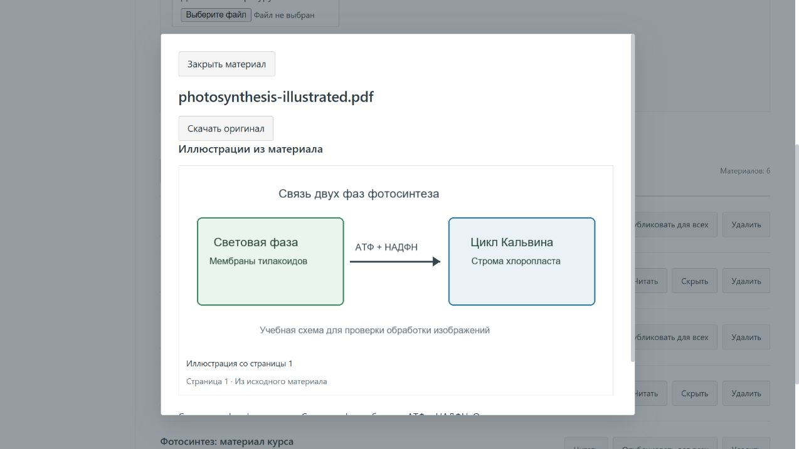
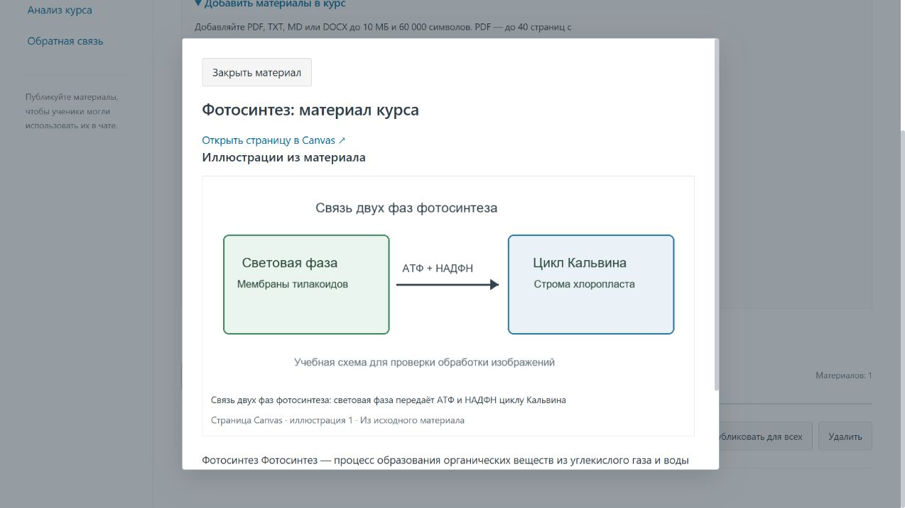
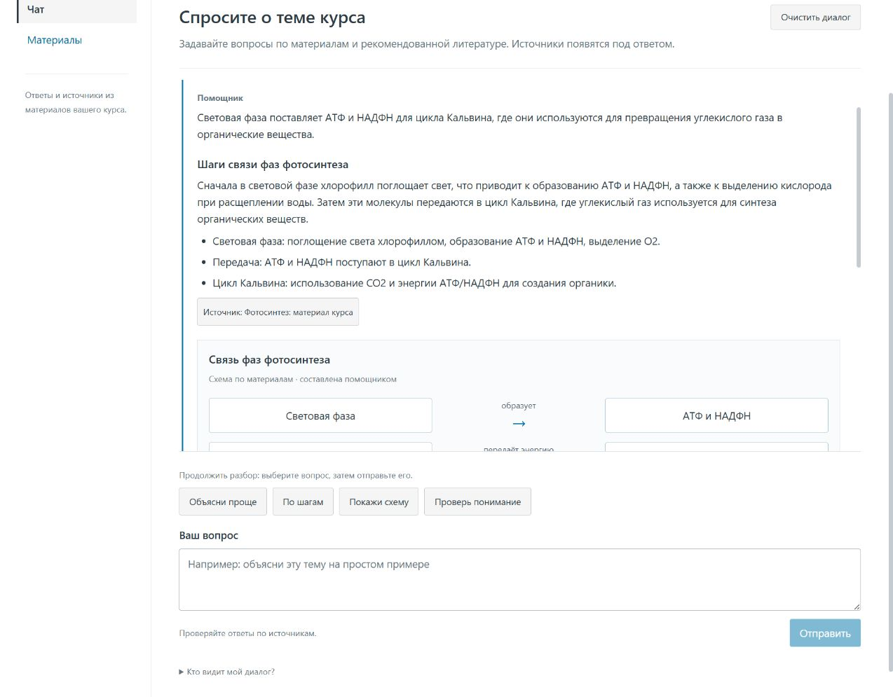
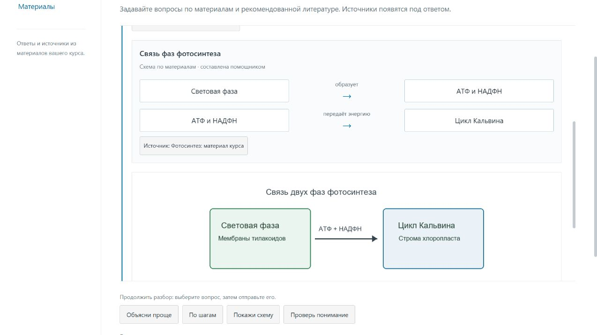
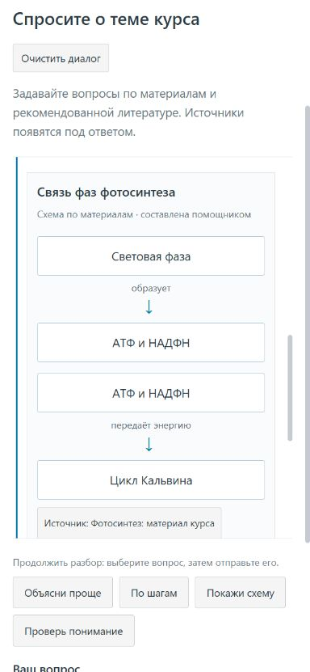

# Интерфейс помощника курса

Повторный UX-аудит: [логика продукта, пути ученика и преподавателя, приоритеты развития](PRODUCT_LOGIC.md). Исправлены обновление настроек журнала и библиотеки, форма оценки материала и сообщения при сетевом сбое. Свежие снимки: [ответ по загруженному DOCX](screenshots/ux-review-docx-answer.png), [проверка понимания](screenshots/ux-review-docx-practice.png).

Обновление 19.09.2026: основной чат остаётся в памяти при переключении разделов; материал открывается с отдельным чатом и выбором фрагмента, учебным упражнением и переходом к странице PDF. В кабинете преподавателя добавлен раздел «Качество ответов» с настройками и добровольным журналом без ID учеников. Импорт курса работает с модулями/файлами и отчётом, чат — с остановкой/повтором и локальным сохранением по выбору. Актуальные сценарии и приватность описаны в [руководстве пользователя](USER_GUIDE.md).


Светлый интерфейс в духе Canvas: навигация курса слева, синее основное действие, нейтральные поверхности, тонкие границы и читаемые заголовки. На небольшом экране навигация переносится наверх. Шрифты системные, без внешней загрузки.

## Ученик

Чат предлагает примеры вопросов, показывает цитаты под ответом и позволяет открыть полный материал. Объяснение обработки диалога доступно рядом с формой. В библиотеке можно искать материалы по названию и оставить отдельный отзыв.


## Преподаватель

Библиотека содержит поиск и фильтр «Все материалы / Опубликованные / Черновики». Загрузка литературы и импорт Canvas находятся в раскрываемом блоке. Чтение, публикация, скрытие и удаление доступны у каждого материала. Анализ и обратная связь вынесены в отдельные разделы.


## Studio

Общие цвета и типографика применены также к студии, графу и состояниям задач. Навигация содержит рабочие разделы; декоративные счётчики и пункты без действий удалены. Поиск в шапке открывает раздел поиска, кнопка датасета переводит к выбору ID.


## Проверка

Дополнительный аудит выполнен в работающем локальном приложении с PostgreSQL, Redis, семантической моделью и Letovo: [сценарии и ограничения](PILOT_VERIFICATION.md). Пользовательские шаги описаны в [руководстве](USER_GUIDE.md).

Мобильная библиотека и анализ при ширине 768 px в автоматических проверках компоновки:


Скриншоты получены из production-сборки с **синтетическими данными и подменённым API**, без данных учеников. Проверены широкая и мобильная компоновка в Chrome, поиск/фильтры, роли, публикация, чат, источники, отзывы, окончание сессии и навигация студии. Диалоги поддерживают Tab, Shift+Tab, Escape и возврат фокуса к открывшей кнопке; есть ссылка пропуска навигации и поддержка reduced motion.

```powershell
cd frontend
npm run build
$env:PLAYWRIGHT_CHANNEL = 'chrome'
npm run test:e2e
```

Эти проверки интерфейса не заменяют приёмку реального LTI-запуска в Canvas; см. [отчёт пилота](PILOT_VERIFICATION.md).

## Иллюстрации из PDF и DOCX

Следующие снимки сделаны в работающем локальном приложении с настоящими PostgreSQL, Redis, семантическим поиском и ответом Letovo DeepSeek. Для проверки использованы специально подготовленные учебные файлы о фотосинтезе, без данных учеников. Школьный Canvas заменён локальной тестовой средой LTI.

Чат выбирает иллюстрацию по подписи и окружающему тексту. Под изображением указано его положение в документе и есть кнопка открытия источника. Понимание пикселей и OCR не выполняются.



В окне материала видны извлечённые изображения, номер страницы PDF и кнопка скачивания оригинала. Изображения и оригиналы доступны только участникам курса с правом чтения материала.



Дополнительно проверена мобильная компоновка: изображения уменьшаются по ширине карточки, подписи и кнопки переносятся без горизонтального переполнения.

## Страницы Canvas, объяснения и схемы

Импорт страниц теперь сохраняет прикреплённые изображения курса с подписью и текстовым контекстом. В просмотре материала есть переход на исходную страницу Canvas.



Развёрнутый ответ содержит смысловые разделы, списки и при необходимости схему связей. Составленная помощником схема помечена отдельно от картинки источника и имеет собственную кнопку материала. Кнопки «Объясни проще», «По шагам», «Покажи схему» и «Проверь понимание» подставляют уточнение в поле вопроса; ученик может отредактировать его перед отправкой.

Живой пример ниже получен от Letovo DeepSeek в работающем локальном приложении. Только школьный Canvas представлен тестовой страницей и файлом; запрос модели не подменён.






